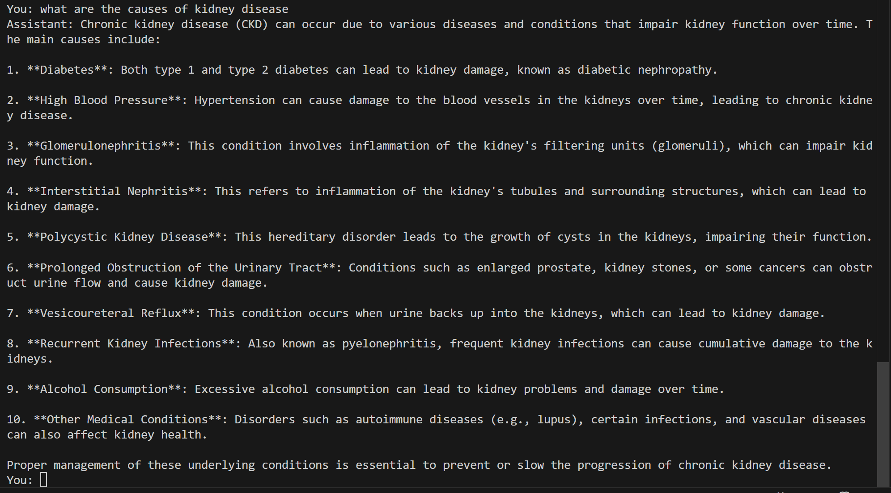
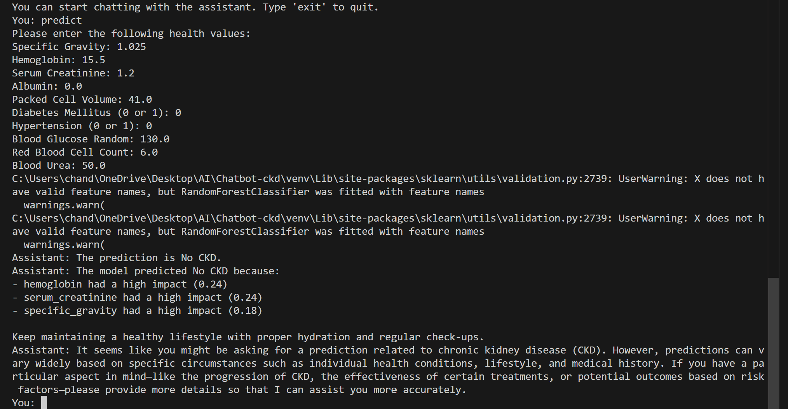

# Azure OpenAI Chat Integration

This project demonstrates how to interact with Azure OpenAI’s API using Python, sending a query to a language model (LLM) and getting a response.

## Requirements

- Python 3.x
- `langchain_openai`
- `python-dotenv`

## Installation

1. Install dependencies:

   ```bash
   pip install -r requirements.txt
   ```

2. Create a `.env` file with your Azure OpenAI credentials:

   ```env
   OPENAI_API_KEY=your_api_key
   OPENAI_API_BASE=https://your-endpoint.azure.com/
   OPENAI_ORGANIZATION=your_org_id
   MODEL=''
   API_VERSION=''
   ```

## Usage

Run the script:

```bash
python predictionChatbot.py
```

## Current Implementation

### Ask questions to chatbot



### Ask Chatbot to predict CKD by using the keyword "predict"


